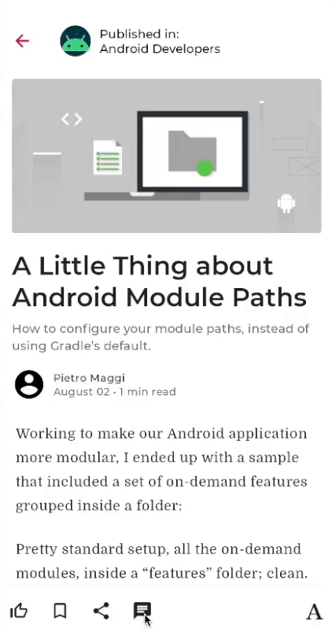

# Add Push Notifications to an Android Kotlin Application using PubNub
In this tutorial you’ll discover how to set up and add push notifications/messaging to an application.
You will integrate push notifications to an application that allows users to receive updates, even when the application is in the foreground, background, and even closed. The [detailed, step-by-step tutorial](https://www.pubnub.com/tutorial/simple-chat-app-android-kotlin/) is also located at on PubNub's website.

If you would like to learn more about how the chat application was constructed, follow our [Android Kotlin Simple Chat Application Tutorial](https://www.pubnub.com/tutorial/simple-chat-app-android-kotlin/). A [detailed tutorial](https://www.pubnub.com/tutorial/simple-chat-app-android-kotlin/) is available for a step-by-step guide on how easy it is to integrate chat into your own application.

The open-source application used is JetNews, which is a sample news reading app built with
[Jetpack Compose](https://developer.android.com/jetpack/compose). 



## Features

This application contains the base JetNews functionality along with a chat room for each article for users to be able to chat about the article they have just read. Users can view a list of articles, read each article, and chat about these articles with other users.
* Pre-built UI Component that renders and handles displaying the chat room.
* Send messages to other users in the chat room.
* Receive messages from other users in the chat room.
* See past messages from other users in the chat room, even if the current user is offline.
* See typing indicators from users in the [debug console](https://www.pubnub.com/docs/console) and interact with the Android app in real-time.
* Receive push notifications using FCM regardless of application state (foreground, background, closed).

## Installing / Getting started

### Requirements
- [Latest Stable Release of Android Studio](https://developer.android.com/studio)
- [Firebase Console Access](https://console.firebase.google.com/u/0/)
- [PubNub Account](#pubnub-account) (*Free*)

<a href="https://dashboard.pubnub.com/signup">
	
</a>

### Create a Firebase Project & Obtain Server Key Token
1. Navigate to the [Firebase Console](https://console.firebase.google.com/u/0/).
2. Press the Create a project button and enter in the name of your project. The Firebase console will automatically replace hyphens with spaces. Press continue.
3. Disable Google Analytics for your application by clicking on the blue slider as you will not need it for this project. Press create project.
4. After some time, the project will be ready. Press continue. You will be redirected to the Project Overview page.
5. In the center of the page, click on the Android App Icon in the "Get started by adding Firebase to your app" section to add an Android application to your Firebase project.
6. Register the Android app by providing the Android package name (in this case com.example.jetnews). You can find this package name by navigating to the app level build.gradle file (usually app/build.gradle), and looking at android -> defaultConfig -> applicationId. Click on Register App.
7. Download the google-services.json config file. This file is the bridge between your FCM project and your Android application. You will need to add this file to the application module root directory (app). This will be detailed shortly. Click next.
8. Do not add the Firebase SDK. You will be using the PubNub SDK and a different Firebase library. These dependencies have already been added to the application and will be discussed shortly.
9. Click next, and then click Continue to console. You should be brought back to the Project Overview Page for the project.
10. In the top left corner, click on the gear icon next to the Project Overview label and select Project settings. The Project settings page contains information about your application, and allows you to edit, configure, and obtain necessary information for your application. You can also re-download the google-services.json file in case you have lost it previously.
11. Click on the Cloud Messaging tab. At the top of the page, there are two APIs available: Firebase Cloud Messaging API (V1), which is by default enabled, and Cloud Messaging API (Legacy) which is by default disabled.
12. Enable the Cloud Messaging API (Legacy) by clicking on the three dots, and click on "Manage API in Google Cloud Console". The Google Cloud Console for your app opens in a new tab.
13. Click on Enable to enable Cloud Messaging. After a few seconds, you will have successfully enabled the legacy Cloud Messaging. Close this tab.
14. Refresh the Project settings page. The Cloud Messaging API (Legacy) will now be enabled. In the Key/Token section, copy the entire Token value to a text editor or leave this page open, as you will need to add this token to your PubNub Keyset in the Admin Portal later on.

### Get Your PubNub Keys
1. Sign in to your [PubNub Dashboard](https://admin.pubnub.com/). You are now in the Admin Portal.
2. Go to Apps on the left hand side of the Portal.
3. Click the Create New App button in the top-right of the Portal.
4. Give your app a name.
5. Click Create.
6. Click your new app to open its settings.
7. When you create a new app, the first set of keys are generated automatically. However, a single app can have as many keysets as you like. PubNub recommends that you create separate keysets for production and test environments.
8. Click on the keyset generated.
9. Enable the Presence feature for your keyset. This will be used to show how many users are active. Enter "ENABLE" in all caps to confirm your choice. Leave the default settings.
10. Enable Stream Controller by clicking on the slider to turn it on if it is already not enabled. You can leave the default settings.
11. Enable the Storage and Playback feature for your keyset. Leave the default settings.
12. Enable Push Notifications by clicking on the slider to turn it on. In the Firebase Cloud Messaging section, add the Server key Token value to the FCM API Key field. This Server key token value is obtained from your FCM project in the Firebase console and going to the project settings page, clicking on the Cloud Messaging tab and copying the Server key token value from the Cloud Messaging API (Legacy) field.
13. Click Save Changes on the bottom right of the portal to save your changes.
14. Copy the Publish and Subscribe Keys to a text editor.

### Building and Running
1. Clone the GitHub repository.

	```bash
	git clone https://github.com/olivercarson-pubnub/jetnews-with-chat.git
	```
2. Open the JetNews Folder in Android Studio.
3. Open the gradle.properties file. 
4. Replace the PUBNUB_PUBLISH_KEY and PUBNUB_SUBSCRIBE_KEY values with your own publish and subscribe keys respectively.
5. Move the google-services.json file that was downloaded earlier to the app-level module folder.
6. Sync the gradle file and run the application.
7. Click on an article to read.
8. Click on the chat message icon on the bottom toolbar to open the chat room.
9. Send and receive messages, and view past messages from other users.
10. Generate new users each time the application is restarted.
11. Receive messages in real-time by interacting with the [debug console](https://www.pubnub.com/docs/console). 
12. Include the pn_gcm push message payload field in the JSON message to have the app receive push notifications. An example JSON message to send:
	{
	"text":"PubNub is super cool!",
	 "type":"default",
	 "id":"aswe234vvowasdfpqlasdf", 
	 "pn_gcm": {
	    "notification": {
	      "title": "UUID of User",
	      "body": "PubNub is super cool!"
	     }
	   }
	}

13. When clicking on the push notifications in-app, you will be brought to the chat room for this application.

## Links

- Project homepage: https://pubnub.com
- Detailed Add Push Notifications to an Android Kotlin Application using PubNub Tutorial Link: https://www.pubnub.com/tutorials/push-notifications-android-kotlin
- Add Chat to an Android Kotlin Application using PubNub Chat Components Tutorial: https://www.pubnub.com/tutorial/simple-chat-app-android-kotlin/

## Further Information

Visit [PubNub Push Notifications Docs](https://www.pubnub.com/docs/push/send) to learn more about Push Notifications using PubNub.

Also checkout [PubNub Android Chat Docs](https://www.pubnub.com/docs/chat/components/android/get-started-android) page for more information about how to use Android Chat Components in your own Android app.


## License

```
Copyright 2021 The Android Open Source Project

Licensed under the Apache License, Version 2.0 (the "License");
you may not use this file except in compliance with the License.
You may obtain a copy of the License at

    https://www.apache.org/licenses/LICENSE-2.0

Unless required by applicable law or agreed to in writing, software
distributed under the License is distributed on an "AS IS" BASIS,
WITHOUT WARRANTIES OR CONDITIONS OF ANY KIND, either express or implied.
See the License for the specific language governing permissions and
limitations under the License.
```
